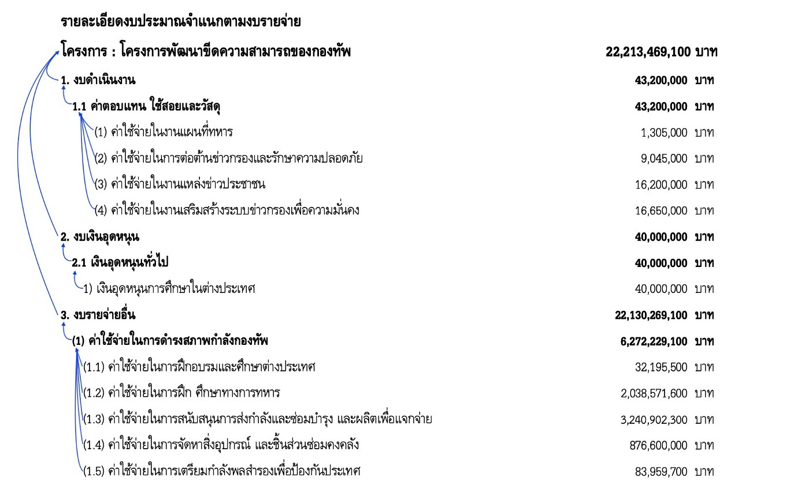
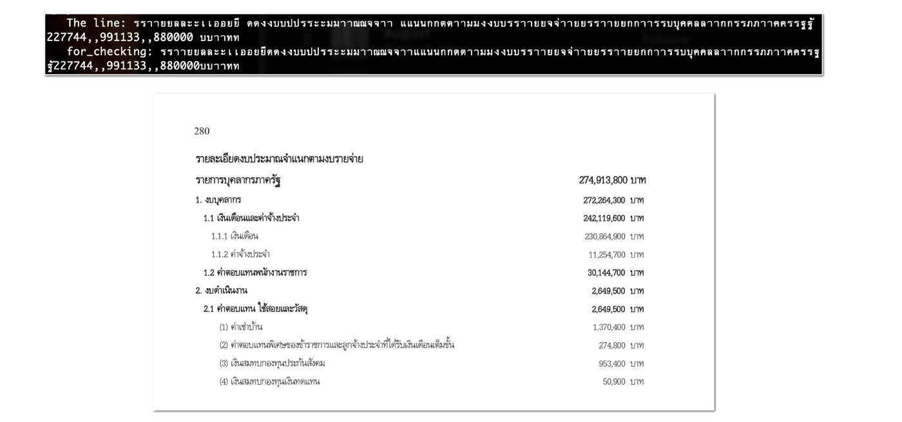
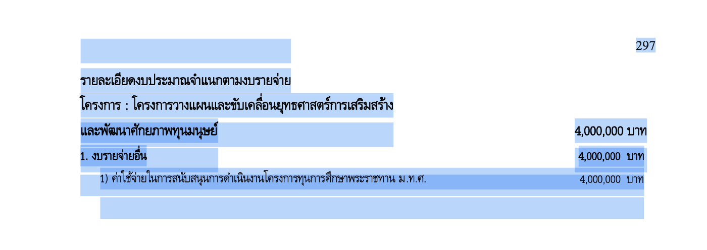
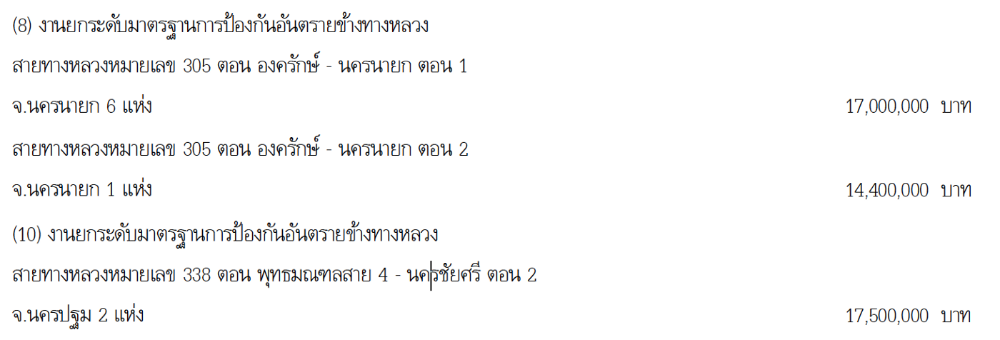
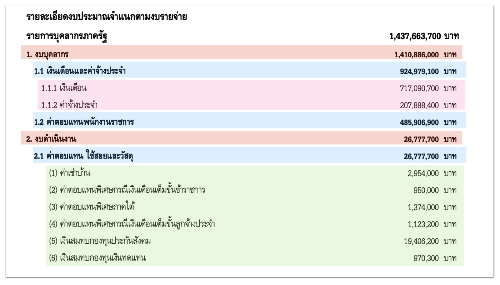
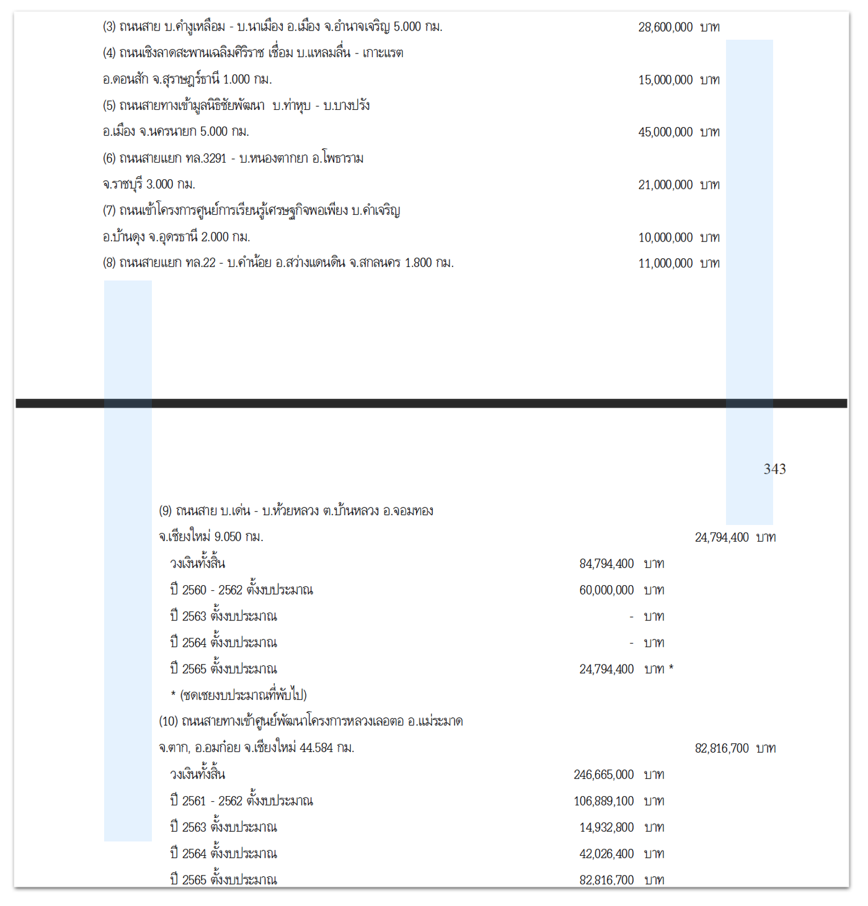

👋🏽 ผมได้ไปเห็นทวีตของ สส. ก้าวไกลคนนึงได้ทวีตว่า [ก้าว・Geek](https://github.com/kaogeek) กำลังทำโปรเจกต์ รวมพลัง Dev แปลงงบ จาก PDF สู่ Machine-readable เลยเห็นว่าน่าสนใจดี เลยลองไปอ่านและลองทำดู

> *เนื่องจากว่างานนี้ทำเสร็จไปนานแล้วแต่เพิ่งอยากมาเขียน อาจมีอะไรตกหล่นบ้าง

## 14,467 หน้า

*เอกสารงบประมาณ ฉบับที่ 3 งบประมาณรายจ่าย หรือ “เล่มขาวคาดแดง”*

ไฟล์ PDF นั้นทำให้ไฟล์ไม่เพี้ยนไปจากไฟล์ต้นฉบับ ไฟล์มีคุณภาพสูง ป้องกันการแก้ไข(มั้ง) เปิดข้ามระบบ (cross platform) ได้ เลยทำได้ง่ายสำหรับการอ่านโดยมนุษย์

แต่จากไฟล์ทั้งหมดที่สนใจ 24 เล่มหรือกว่า 14,467 หน้า ถ้าให้มานั่งอ่านทั้งหมด ไม่ว่าพลเมืองตื่นรู้ (active citizen) คนไหนก็ไม่น่าจะอ่านไหว

สมมุติว่าผมอยากรู้ว่างบประมาณปีนี้ใช้ไปกับการเช่ารถประจำตำแหน่งไปเท่าไหร่ ผมก็ต้องไล่เปิดทุกเล่ม ทุกหน้า ทุกบรรทัด และบวกทุกจำนวนที่เห็น งานแค่นี้อาจใช้เวลาหลายวันจนไม่อยากตื่นรู้ไปด้วยซ้ำ ทั้ง ๆ ที่มันควรจะเป็นงานที่แค่ใช้เวลาไม่กี่วินาที

จากปัญหาตรงนี้ทีม[ก้าว・Geek](https://github.com/kaogeek) เลยทำโปรเจกต์นี้ขึ้นมา

## ขุด ⛏


*โครงสร้างทั่วไปของ ”รายละเอียดงบประมาณจำแนกตามงบรายจ่าย”*

สิ่งที่ทีมต้องการนั้นคือ CSV ที่มีรายการข้อมูลเป็นชั้นในสุดจากภาพด้านบนคือ (1), (2), (3), (4), 1), (1.1), (1.2), (1.3), (1.4), (1.5)

ตัวอย่างของ (1)

```
โครงการพัฒนาขีดความสามารถของกองทัพ > งบดำเนินงาน > ค่าตอบแทน ใช้สอยและวัสดุ > ค่าใช้จ่ายในงานแผนที่ทหาร > 1,305,000
```

ตัวอย่างของ (2)

```
โครงการพัฒนาขีดความสามารถของกองทัพ > งบดำเนินงาน > ค่าตอบแทน ใช้สอยและวัสดุ > ค่าใช้จ่ายในการต่อต้านข่าวกรองและรักษาความปลอดภัย > 9,045,000
```

สำหรับไฟล์ที่เป็นข้อความนั้น งานแบบนี้ไม่ยากเลย แต่ไฟล์ที่เรามีนั้นมันเป็นไฟล์ PDF ซึ่งแค่จะคัดลอกข้อความภาษาไทยใน PDF นั้นยังยากเลย

#### วิธีที่ 1 ใช้ pdfminer.six

ผลที่ได้ออกมายังไม่น่าพอใจ

#### วิธีที่ 2 ใช้ pdfplumber

ถ้าดูผ่าน ๆ ก็เหมือนจะได้ แต่พอได้ตรวจ ก็พบว่า


*เอกสารงบประมาณ ฉบับที่ ๓ งบประมาณรายจ่าย ประจำปีงบประมาณ พ.ศ. ๒๕๖๕ เล่มที่ ๑ หน้าที่ 280*

ตัวอักษรมันขึ้นซ้ำ 2 รอบ จากคำว่า “รายละเอียด” ก็กลายเป็น “รราายยลละะเเออีียยดด” ตอนแรกคิดว่ามันคงผิดที่ pdfplumber อาจจะทำงานได้ไม่ดีกับภาษาไทยหรือโค้ดของเราเขียนผิด

แต่พอลองตรวจกับหน้าอื่นที่ปกติ ก็พบว่าหน้านี้ใช้คนละแบบตัวอักษร (font) กับหน้าอื่น (อาจจะเพราะคนทำคนละคนกัน) “แค่แบบตัวอักษรต่างกันไม่น่าจะส่งผลอะไรไม่ใช่หรอ?” แต่ไม่หยุดแค่นี้ ในหน้าที่แบบอักษรต่างจากหน้าอื่นนั้นพบว่ามีตัวอักษรซ่อนไว้อีกชั้น ถ้าเอาไปพิมพ์ใส่กระดาษก็จะมองไม่เห็น (เหมือนมีจุดผิดแต่ไม่อยากทำใหม่เลยซ่อนอันเก่าไม่ให้เห็น แล้วเขียนทับงานเก่าไปเลย)


*มีตัวอักษรที่มองไม่เห็น แต่สามารถคัดลอกข้อความออกมาได้*

ปัญหานี้จึงทำให้ต้องใช้วิธีถัดไปแทน

#### วิธีที่ 3 ใช้ OCR

วิธีสุดท้ายที่ใช้ในโปรเจกต์นี้คือในเมื่อมีตัวอักษรที่ซ่อนอยู่ [พี่เท้ง](https://github.com/tee4cute)เลยใช้ Google Cloud Vision และผลที่ออกมาน่าพอใจมาก แก้เรื่องสระลอยหรือสระหายได้ แต่ปัญหาก็ยังไม่จบ มีทั้งปัญหาจาก OCR และจากเล่มเอกสารงบประมาณเอง

ปัญหาจาก OCR ของ Google Cloud Vision คือถ้าหากมีแค่ Text อย่างเดียว การเรียงบรรทัดจะเละมาก แต่แก้ได้ด้วยการใช้ Coordinates มาช่วยคำนวณ

ปัญหาจากเล่มเอกสารงบประมาณเอง เช่น ตามภาพข้างล่าง มีข้อ (8) และถัดมาก็เป็น (10) โดย “ลืม(?)” ใส่เลขข้อ (9)


*ตัวอย่างข้อผิดพลาดจากต้นทาง*

ตอนนี้ได้ข้อมูลตามที่ต้องการแล้ว

## กลั่น 🪣

ขั้นถัดมา เอาไฟล์ JSON ที่ได้จาก OCR มาทำ CSV

วาดตัวอย่าง JSON ที่ได้จาก OCR
ข้อมูลที่ได้นั้นเป็น “Text” และ “Coordinates ของ Text” ทั้ง 4 มุม
```js
{
 “vertices”: 
    [
     {“x”: 914, “y”: 660}, 
     {“x”: 987, “y”: 659}, 
     {“x”: 987, “y”: 682},
     {“x”: 914, “y”: 683}
    ],
 “description”: “งบลงทุน”
}
```
นำไปเฉลี่ย
```js
{
 “simplified-vertices”: 
    [
     [914, 987],     //ค่า x
     [659.5, 682.5]  //ค่า y
    ],
 “text”: “งบลงทุน”
}
```

หลังจากนั้นจะนำค่า y ของแต่ละคำมาจัดกลุ่มบรรทัด หากค่า y ของสองคำมีค่าใกล้เคียงกัน ก็จะถือว่าอยู่ในบรรทัดเดียวกัน



ส่วนค่าตำแหน่ง x นั้นใช้สำหรับการแยกการแยกลำดับศักดิ์ของรายการนั้น ๆ กล่าวคือ

1. หากค่า x ของบรรทัดมีค่ามากก็จะถือว่าลำดับศักดิ์ต่ำกว่าอีกบรรทัดที่มีค่า x น้อยกว่า
2. หากค่า x ของบรรทัดมีค่าน้อยก็จะถือว่าลำดับศักดิ์สูงกว่าอีกบรรทัดที่มีค่า x มากกว่า
3. หากค่า x ของสองบรรทัดมีค่าใกล้เคียงกันมาก (1) ถือว่าลำดับศักดิ์เท่ากัน หรือ (2) เป็นรายการเดียวกัน

แต่จะมีปัญหาทันทีเมื่อรายละเอียดงบประมาณมีหลายหน้า เพราะหน้าที่เป็นเลขคู่ และหน้าที่เป็นเลขคี่จะเว้นขอบกระดาษไม่เท่ากัน


*หน้าคู่เว้นขอบด้านขวาเยอะ แต่หน้าคี่จะเว้นทางซ้ายเยอะ*

ในภาพด้านบนเป็นหน้าเลขคู่ และด้านล่างเป็นหน้าเลขคี่ เห็นได้ชัดเลยว่ามีการเว้นขอบหน้า และหลังไม่เท่ากัน เลยทำให้เกิดอุปสรรคอีกหนึ่งอย่าง

ในสองหน้านี้ รายการหมายเลข (8) และหมายเลข (9) มีลำดับศักดิ์เท่ากัน แต่เมื่ออยู่ต่างหน้ากันแล้ว ทำให้ตำแหน่งแกน x ต่างกันมากเลยต้องหาวิธีที่หาค่าที่ต่างกันระหว่างหน้าของแกน x

การใช้ค่าคงที่นั้นจะใช้ไม่ได้เพราะแต่ละเล่มเว้นไม่เท่ากัน (🥲 เส้า) แต่ใช้คำว่า “บาท” เป็นจุดอ้างอิงสำหรับหาความต่างแทน เนื่องจากว่าเป็นคำที่มีอยู่ในทุกหน้า

นอกจากจะใช้ตำแหน่ง x แล้วยังใช้เลขนำหน้า (prefix/bullet) มาใช้ในการเรียงลำดับศักดิ์ด้วย เพื่อใช้ยืนยันความถูกต้อง เนื่องจากว่าบางครั้งข้อมูลจาก OCR ผิด และหลายครั้งเอกสารงบประมาณเองที่ผิด

## เอกสารงบ ชุ่ย 😭

ระหว่างที่ทำโปรเจกต์นี้มีข้อผิดพลาดหลายจุดมากที่ผมเจอ อยากจะให้อภัยนะ เพราะมันเกือบ 15K หน้า แต่มันคือเอกสารงบประมาณ ควรต้องไม่มีรึเปล่า
- สารบัญเลขหน้าผิด
- พิมพ์ผิด
- พิมพ์ซ้ำหัวข้อเดิม
- หมายเลข (bullet) ผิด/ขาด
- อื่น ๆ
สำหรับ output จากโปรเจกต์นี้อาจจะไม่มีประโยชน์มากนักแล้ว (เพราะเลยวันพิจรณางบไปแล้ว) แต่อยากให้ไปลองดู [thailand-budget-pdf2csv](https://github.com/kaogeek/thailand-budget-pdf2csv) นะครับ